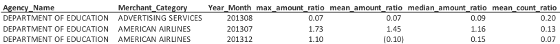
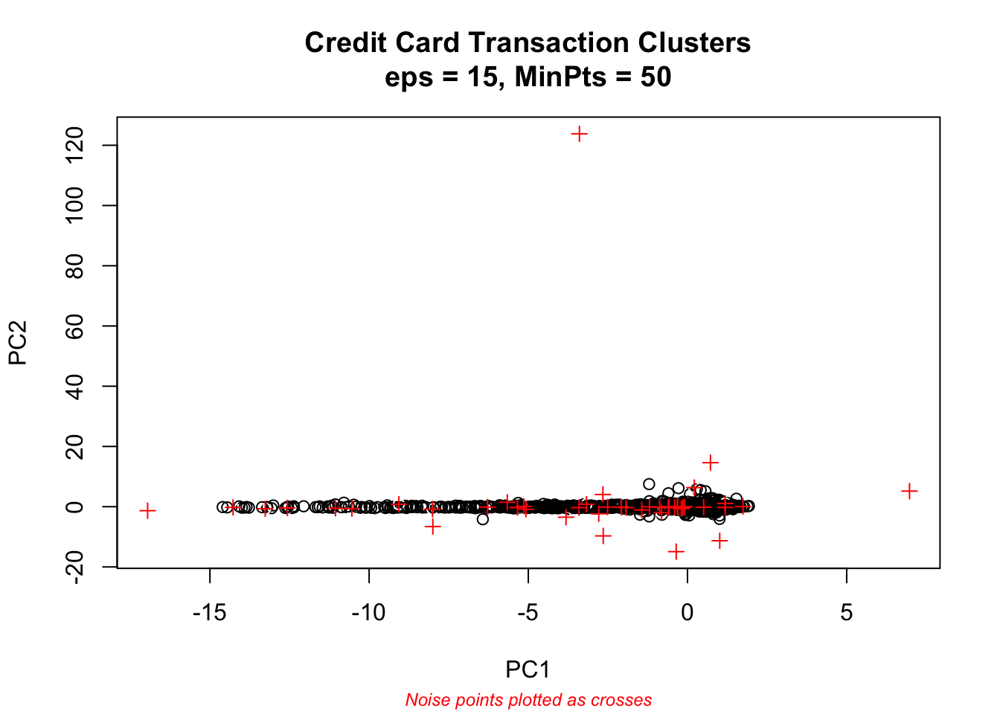
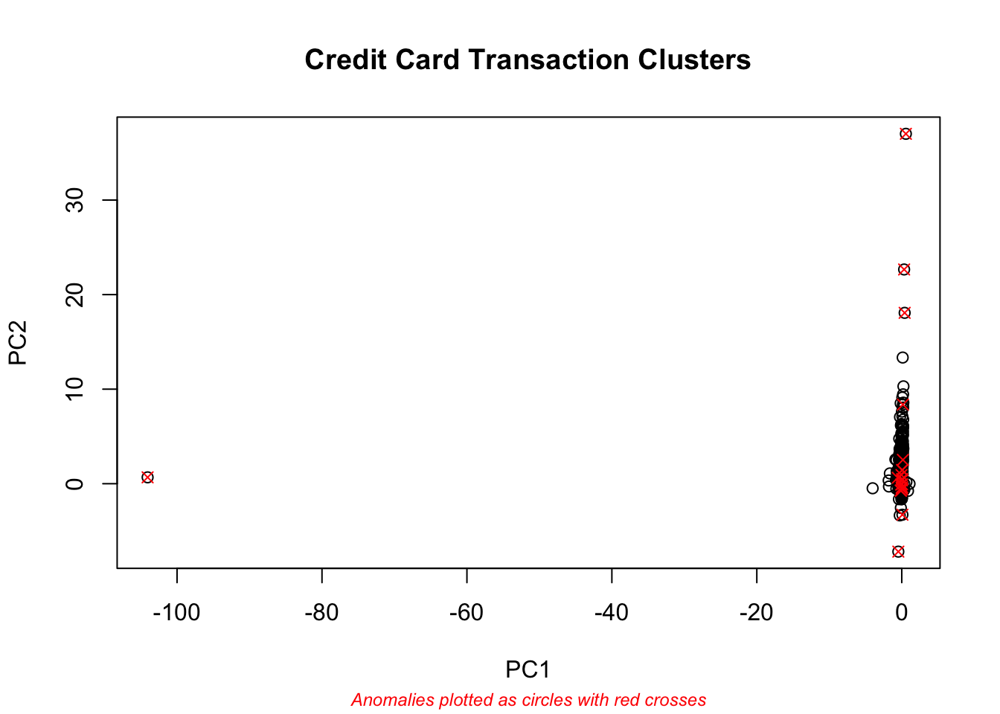

# Anomaly Detection: Credit Card Industry
# Dataset
## Oklahoma Purchase Credit Card Transactions
The Office of Management and Enterprise Services in the State of Oklahoma has made its [purchase credit card transactions](https://catalog.data.gov/dataset/purchase-card-pcard-fiscal-year-2014) available. This dataset contains information on purchases made through the purchase card programs administered by the state and higher education institutions. 
## Overview
This dataset is comprised of 442,458 observations and 11 columns. The variables consist of:
- Year-Month
- Agency Number
- Agency Name
- Cardholder Last Name
- Cardholder First Initial
- Description
- Amount
- Vendor
- Transaction Date
- Posted Date
- Merchant Category Code (MCC)

# Feature Creation
## Monetary Feature
Add: Max, Average and Median Amount Ratio Features by Agency Name and Merchant Category

## Recency Feature
Recency(time since last transaction)

Add: Max, Average and Median Recency Ratio Features by Agency Name and Merchant Category

# DBSCAN Modeling Technique
## DBCAN Method
DBSCAN is a density based clustering algorithm.  Unlike K-means, which makes round clusters, DBSCAN can handle clusters of various shapes and sizes. It is therefore able to find clusters that K-means is unable to discover. For fraud analysis, DBSCAN will group together points that are closely packed together and mark outlier points that lie outside these clusters.  These outlier points could be possible fraudulent transactions.

## DBSCAN Model
Hyperparameters tuned include:

minPts - how many neighbors a point should have to be included into a cluster   

eps (epsilon) - how close points should be to each other to be considered a part of a cluster   

## Best Model with Hyperparameters of MinPts=50 and eps=15
It appears that using eps of 15 and MinPts of 50 resulted in a reasonable model.  It clustered the data points into 1 cluster with 46 outliers.

## Anomalies

## Business Insight
Agency transactions that occurred within the merchant category listed in the above table could possibly be fraud based on my DBSCAN analysis.  Transactions that occurred within these merchant categories at these agencies require further analysis to determine if fraud actually occurred. 

# MeanShift Modeling Technique
## MeanShift Method
The mean shift algorithm is a non parametric clustering technique. It can handle clusters of various shapes and sizes and prior knowledge of the number of clusters is not required. For each data point, mean shift defines a window around it and computes the mean of the data point. It then shifts the center of the window towards the mean and repeats the algorithm until it converges. For fraud analysis, data points far from the centroids can be ignored by the clustering process and flagged as anomalies. These anomaly points could be possible fraudulent transactions.

## MeanShift Model
Hyperparameter tuned include:  

h: a positive bandwidth parameter. Larger values of h produce few and large clusters. Smaller values of h produce many small clusters. 

I analyzed h values of: 10, 20, 30, 50 and 75.

## Best Model with hyperparameter of h=20
It appears that using h of 20 resulted in a reasonable model.  It clustered the data points into 1 primary cluster with 22 anomalies.

## Anomalies

## Business Insight
Agency transactions that occurred within the merchant category listed in the fraud data frame could possibly be fraud based on my MeanShift analysis.  Transactions that occurred within these merchant categories at these agencies require further analysis to determine if fraud actually occurred. 
Grand River Dam Auth had the highest number of merchant categories, 4, that might contain fraudulent transactions.  

# Autoencoder Modeling Technique
## Autoencoder Method
Autoencoder is an unsupervised, neural network algorithm that uses backpropagation, setting the target values equal to the inputs. Autoencoders compress the input into a latent-space representation, and then reconstructs the output from this representation. It is typically used for dimension reduction. 

## Autoencoder Model
Hyperparameters tuned:
Hidden layers: 5, 2, 5 and 10, 2, 10
Epochs: 50, 100, 200

## Anomalies

## Business Insight
Agency transactions that occurred within the merchant category listed in the table above could possibly be fraud based on my Autoencoder analysis.  Transactions that occurred within these merchant categories at these agencies require further analysis to determine if fraud actually occurred. 

Of the five agency transactions flagged as possible anomalies using Autoencoder, all but one was also flagged with my MeanShift model.  The one data point that was flagged by Autoencoder but not MeanShift was the Holiday Inns category of the Department of Agriculture. 

Overall, I found using Autoencoder more challenging for anomaly detection than MeanShift as the model did not cluster data points. 
