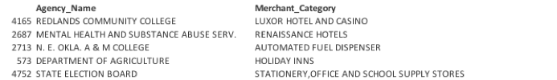

# Anomaly Detection: Credit Card Industry
# Dataset
## Oklahoma Purchase Credit Card Transactions
The Office of Management and Enterprise Services in the State of Oklahoma has made its [purchase credit card transactions](https://catalog.data.gov/dataset/purchase-card-pcard-fiscal-year-2014) available. This dataset contains information on purchases made through the purchase card programs administered by the state and higher education institutions. 
## Overview
This dataset is comprised of 442,458 observations and 11 columns. The variables consist of:
- Year-Month
- Agency Number
- Agency Name
- Cardholder Last Name
- Cardholder First Initial
- Description
- Amount
- Vendor
- Transaction Date
- Posted Date
- Merchant Category Code (MCC)

# Feature Creation
## Monetary Feature
Add: Max, Average and Median Amount Ratio Features by Agency Name and Merchant Category

## Recency Feature
Recency(time since last transaction)

Add: Max, Average and Median Recency Ratio Features by Agency Name and Merchant Category

# DBSCAN Modeling Technique
## DBCAN Method
DBSCAN is a density based clustering algorithm.  Unlike K-means, which makes round clusters, DBSCAN can handle clusters of various shapes and sizes. It is therefore able to find clusters that K-means is unable to discover. For fraud analysis, DBSCAN will group together points that are closely packed together and mark outlier points that lie outside these clusters.  These outlier points could be possible fraudulent transactions.

## DBSCAN Model
Hyperparameters tuned include:

minPts - how many neighbors a point should have to be included into a cluster   

eps (epsilon) - how close points should be to each other to be considered a part of a cluster   

## Best Model with Hyperparameters of MinPts=50 and eps=15
It appears that using eps of 15 and MinPts of 50 resulted in a reasonable model.  It clustered the data points into 1 cluster with 46 outliers.

## Anomalies

## Business Insight
Agency transactions that occurred within the merchant category listed in the above table could possibly be fraud based on my DBSCAN analysis.  Transactions that occurred within these merchant categories at these agencies require further analysis to determine if fraud actually occurred. 

# MeanShift Modeling Technique
## MeanShift Method
The mean shift algorithm is a non parametric clustering technique. It can handle clusters of various shapes and sizes and prior knowledge of the number of clusters is not required. For each data point, mean shift defines a window around it and computes the mean of the data point. It then shifts the center of the window towards the mean and repeats the algorithm until it converges. For fraud analysis, data points far from the centroids can be ignored by the clustering process and flagged as anomalies. These anomaly points could be possible fraudulent transactions.

## MeanShift Model
Hyperparameter tuned include:  

h: a positive bandwidth parameter. Larger values of h produce few and large clusters. Smaller values of h produce many small clusters. 

I analyzed h values of: 10, 20, 30, 50 and 75.

## Best Model with hyperparameter of h=20
It appears that using h of 20 resulted in a reasonable model.  It clustered the data points into 1 primary cluster with 22 anomalies.

## Anomalies

## Business Insight
Agency transactions that occurred within the merchant category listed in the fraud data frame could possibly be fraud based on my MeanShift analysis.  Transactions that occurred within these merchant categories at these agencies require further analysis to determine if fraud actually occurred. 
Grand River Dam Auth had the highest number of merchant categories, 4, that might contain fraudulent transactions.  

# Autoencoder Modeling Technique
## Autoencoder Method
Autoencoder is an unsupervised, neural network algorithm that uses backpropagation, setting the target values equal to the inputs. Autoencoders compress the input into a latent-space representation, and then reconstructs the output from this representation. It is typically used for dimension reduction. 

## Autoencoder Model
Hyperparameters tuned:  

Hidden layers: 5, 2, 5 and 10, 2, 10  

Epochs: 50, 100, 200  

## Anomalies

## Business Insight
Agency transactions that occurred within the merchant category listed in the table above could possibly be fraud based on my Autoencoder analysis.  Transactions that occurred within these merchant categories at these agencies require further analysis to determine if fraud actually occurred. 

Of the five agency transactions flagged as possible anomalies using Autoencoder, all but one was also flagged with my MeanShift model.  The one data point that was flagged by Autoencoder but not MeanShift was the Holiday Inns category of the Department of Agriculture. 

Overall, I found using Autoencoder more challenging for anomaly detection than MeanShift as the model did not cluster data points. 

# Random Forest Modeling Technique
## Random Forest Method
The random forest classifier is a supervised learning technique. The model creates a set of decision trees from randomly selected subsets of the training set, it then aggregates the votes from different decision trees to decide the final class of the test object 

## Randomg Forest Model
Hyperparameters tuned include:  

ntrees = Number of trees. I used 200, 500, 1000, 1500, 2000.  

max_depth = Maximum tree depth. I used 5, 10, 15, 20, 25, 30.  

Grid Search: I used H2o's grid search to train and validate numerous models at once based on different hyper-parameter levels.

Performance Metrics: In order to evaluate the performance of a model on a given data set, it is necessary to measure how well the model's predictions actually match the observed data.

MSE = Mean squared error, it measures the square of the errors. The MSE will be small if the predicted responses are very close to the true responses, and it will be large if the predicted and true responses differ substantially. MSE is vulnerable to outliers and is in a different scale than the measured units. Used in regression (continuous output).

RMSE = Root mean squared error. It is the square root of the average of squared differences between prediction and actual observation (MSE). Lower values are better. It is scale dependent, therefore if the scales of the dependent variables differ across models, you can't compare RMSEs. Used in regression (continuous output).

Log Loss = Logarithmic loss measures the performance of a classification model where the prediction input is a probability value between 0 and 1. Lower values are better. "Log Loss takes into account the uncertainty of your prediction based on how much it varies from the actual label. This gives us a more nuanced view into the performance of our model."

AUC = The overall performance of a classifier, summarized over all possible thresholds, is given by the area under the (ROC) curve (AUC). It is used in classification analysis to determine which model predicted the classes best. It is typically used with binary classification. Not very useful for imbalanced data as it doesn’t place more emphasis on one class over the other (i.e. it does not reflect the minority class well).

Gini = The Gini coefficient can be used to evaluate the performance of a classifier. It is the ratio between area between the ROC curve and the diagonal line and the area of the above triangle (Gini = 2*AUC – 1). Gini above 60% is viewed as a good model.

Precision = Measures that fraction of examples classified as positive that are truly positive (i.e. when the model predicts positive, how often is it correct?)

Recall = True positive rate (i.e. when it's actually positive, how often does it predict positive?).

F1 = Measure of a model's accuracy. It's the harmonic average of precision and recall, where an F1 score reaches its best value at 1 (perfect precision and recall) and worst at 0.

Down-Sampling for the Majority Class: Fraud transactions (the positive class) represent 0.173% of the data set, resulting in a highly imbalanced data set. Were I to run my model on the data set as is, it would bias the prediction model towards the more common non-fraudulent class. It is therefore necessary to balance the data set. I choose to use down-sampling, which creates a more balanced data set by selecting a random sample from the majority class. After down-sampling, fraud transactions represent 10% of the training data set.

Results: Out of all the models with varying number of trees and maximum tree depths, I choose the model with the highest AUC on the validation set as the best model. This model used 50 trees and had a max depth of 15. I then evaluated the model performance on my test set.

The test set performance metrics at the threshold that maximizes the F-statistic:
LogLoss: 0.02584733
AUC: 0.9709288
Gini: 0.9418577
Precision: 0.762
Recall: 0.811
F1: 0.786

I used the above metrics to determine my model’s performance. As my dataset was imbalanced I primarily used Precision, Recall and the F-score to evaluate my model performance. All of which indicate that the model is good.

In a business use case a credit card company would prefer more false positives than false negatives. That is the company would rather incorrectly identify a transaction as fraud than identify a fraudulent transaction as legitimate. Therefore, for my performance metrics I preferred high Recall, which is a low false negative rate rather than high Precision, which is a low false positive rate.
